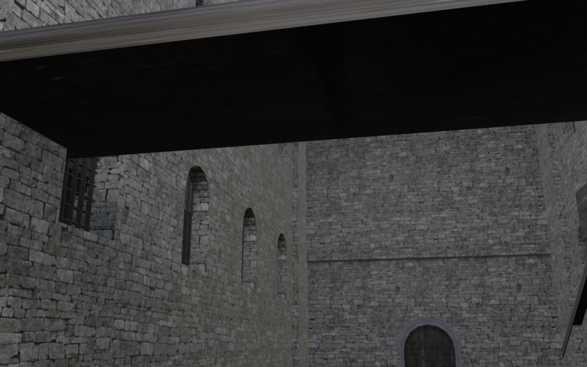

# 🕯️ SANCTUM — LIVE VISUAL PREVIEW

**Refresh this page after a build finishes.** This branch updates automatically. While Hero is rendering it shows the last GREEN Sanctum view; when Hero finishes it switches to the new entrance/player-view render.

## Reference vs current build

### Reference

### Current GitHub build

Tap either image to open it full-size and zoom.

**Current source:** vertical. **Hero camera target:** raised entrance view · eye height — m · — mm lens.

**Runtime gates from the same build:** Hero PASS · Recast PASS · nav polygons 40 · vertical span 7.4 m · bands 5 · CoACD PASS · hulls 51 · GLB validator errors 0.

## Other live angles

[Mid nave](mid-nave.png) · [Three-quarter](three-quarter.png) · [Side](side.png)

Source workflow run: https://github.com/1993velezpadilla-source/config-old-3/actions/runs/36949132649

Updated UTC: 2026-10-02T03:12:56.877738+00:00
